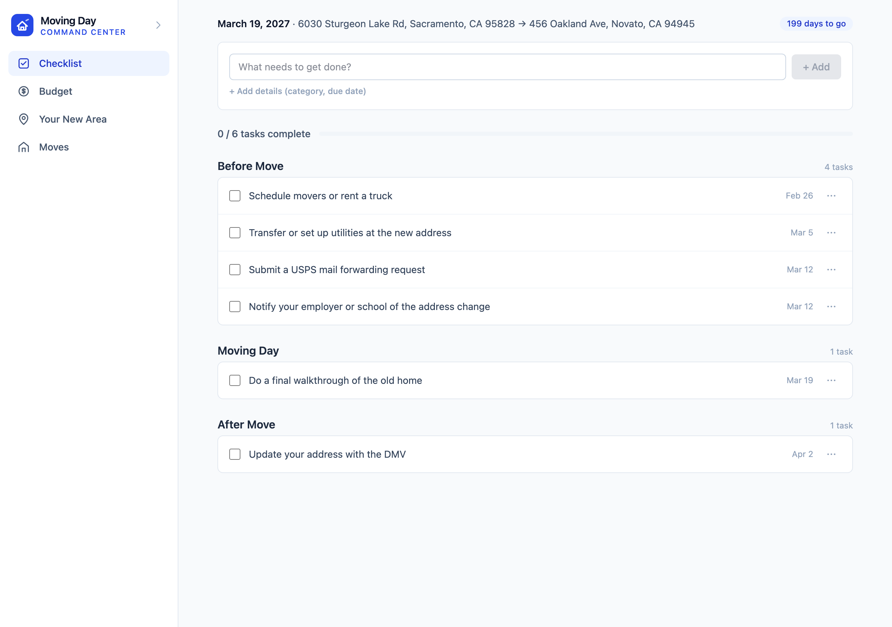
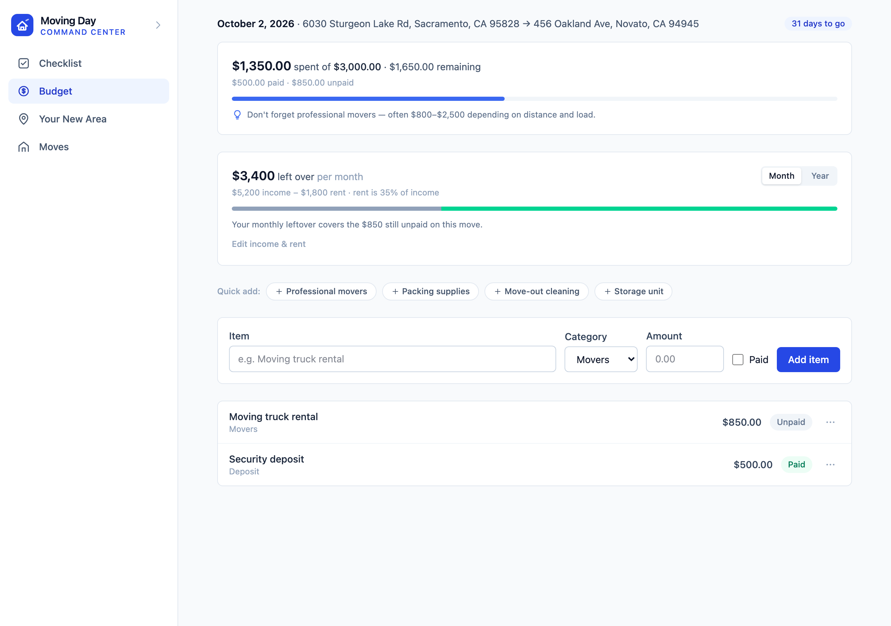
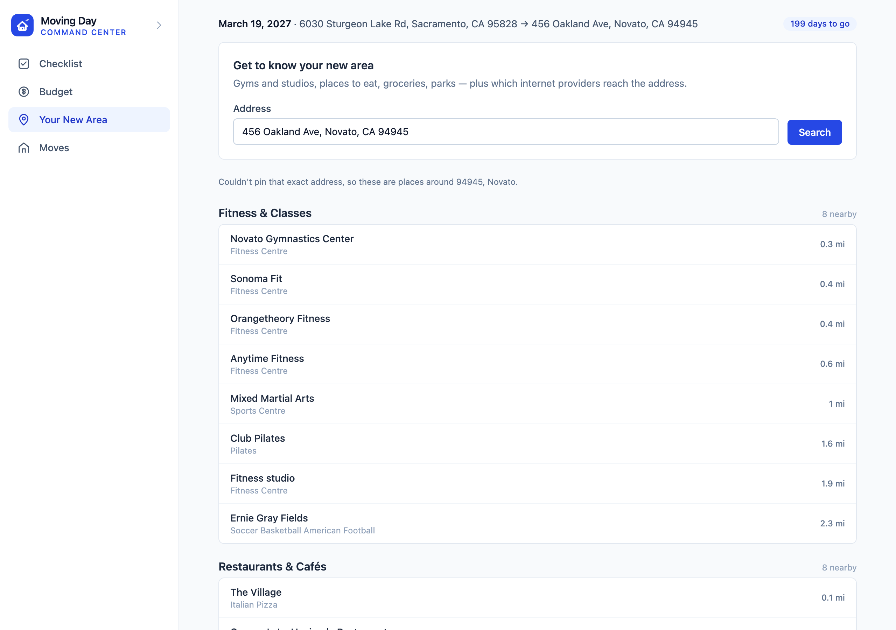

# 🏠 Moving Day Command Center

A full-stack app for managing a move end-to-end: a task checklist, a budget
tracker, and a real technical feature — looking up which internet providers
serve a new address using public FCC broadband data, alongside what's actually
around the destination (gyms and studios, food, groceries, parks).

Built as a portfolio project (Summer 2027 internship cycle). The goal wasn't
feature count — it's one genuinely hard integration done honestly, clean
architecture, and the security/engineering habits a production app actually
needs.

**Live demo:** _TODO — filled in after deployment_
**Repo:** you're in it

## Screenshots

| Checklist | Budget | Your New Area |
|---|---|---|
|  |  |  |

## Architecture

```
┌─────────────────┐        /api/*  ┌──────────────────┐        ┌──────────────┐
│  React (Vite)    │ ─────────────▶ │  Express API      │ ─────▶ │  PostgreSQL   │
│  client/          │                │  server/           │        │  (Prisma)     │
└─────────────────┘                └──────────────────┘        └──────────────┘
                                             │
                                             │ server-side only — never called
                                             │ from the browser
                                             ▼
                                 ┌───────────────────────┐
                                 │ US Census Geocoder      │  (free, keyless)
                                 │ OSM Nominatim           │  (free, keyless)
                                 │ OSM Overpass            │  (free, keyless)
                                 │ FCC Broadband Data       │  (requires a free
                                 │ Collection (BDC) API     │   registered token)
                                 └───────────────────────┘
```

- **Frontend** (`client/`): React 19 + Vite + Tailwind v4. Calls only its own
  backend via a thin fetch wrapper (`src/lib/apiClient.js`).
- **Backend** (`server/`): Express + Prisma + PostgreSQL. Owns every external
  API call, all validation, rate limiting, and caching.
- **Database**: PostgreSQL everywhere — local dev and production — so there's
  one dialect to reason about, no SQLite/Postgres drift.

## The hard part: provider lookup

`GET /api/provider-lookup?address=` (or `?zip=`) does three things:

1. **Geocodes** the address via the [US Census Geocoder](https://geocoding.geo.census.gov/geocoder/Geocoding_Services_API.pdf) —
   free and keyless, and it returns the census block FIPS code, which is
   exactly what FCC broadband data is keyed by. No secret to manage for this
   half of the integration.
2. **Queries the FCC Broadband Data Collection (BDC) API** for providers at
   that location, through a swappable `ProviderDataSource` adapter
   (`server/src/services/providerDataSource.js`).
3. **Caches** the result in Postgres (`provider_lookups`), keyed by a hash of
   the normalized query. A fresh cache hit skips the network entirely; if the
   live call fails, the *last successful* result is served instead (flagged
   `stale: true`) rather than showing a broken page. Only "no live data and
   nothing cached" becomes a visible error state.

**Honest status of the FCC integration:** `bdc.fcc.gov` (the actual API host)
is live and its `/api/public/map/*` routes are real — confirmed by probing
them directly. But the FCC's human-facing map and its own API docs PDF sit
behind an Akamai WAF that blocked this dev environment outright, so the exact
request/response shape couldn't be verified live while building this. The API
also requires a free **registered account and token** from `bdc.fcc.gov` — a
personal signup, not something automatable. Until `BDC_API_USERNAME` /
`BDC_API_TOKEN` are set, `getProviderDataSource()` automatically falls back to
a deterministic, clearly-labeled (`source: "mock"`) sample data source — the
UI shows a visible disclaimer banner whenever this happens (see the
screenshot above). This is standard "demo mode" practice for an
unauthenticated upstream, not a placeholder: the adapter, caching, and
fallback logic are all real and fully exercised either way. Swapping in real
credentials is a config change, not a rewrite — see `providerDataSource.js`
for exactly what's verified vs. not.

## Knowing where you are: the geocoding fallback

Exact street-level geocoding fails constantly for legitimate reasons — new
construction, rural routes, unit numbers, plain typos. Refusing to show
anything in those cases makes every location feature look broken, so
`resolveApproximateLocation()` (`server/src/services/geocoding.js`) walks a
ladder and reports how far down it landed:

| Tier | Source | Reported precision |
|---|---|---|
| 1 | Census geocoder (also yields the census block FIPS) | `address` |
| 2 | Nominatim, full address string | `address` |
| 3 | Nominatim, just the ZIP | `area` |
| 4 | Nominatim, just `City, ST` | `area` |

The UI says so plainly when results are area-level rather than exact. Only the
Census tier returns a census block, so an area-level match legitimately can't
drive the live FCC lookup — that's reported honestly rather than faked.

## What's nearby

`GET /api/local-places?address=` returns gyms and studios (pilates, yoga,
dance), restaurants and cafés, groceries and shopping, and parks — grouped,
nearest-first, with straight-line distances.

Backed by [OpenStreetMap's Overpass API](https://overpass-api.de) — free and
keyless, consistent with the rest of the integrations. Two things make it
usable rather than painful:

- **A Postgres cache (`place_lookups`).** Overpass takes ~8s cold versus ~15ms
  cached. A DB cache (not in-memory) is deliberate: it survives the free-tier
  dyno spin-downs that would otherwise make every first visit slow, and it
  doubles as the stale-fallback when Overpass is unreachable.
- **Category caps.** Restaurants always dominate raw results, so each category
  is capped — otherwise the sparse-but-interesting ones get buried.

OSM maps *places*, not schedules, so there's no live events feed here; the
recurring-class case is covered by the studios themselves.

## Setup

### Prerequisites
- Node.js 20+
- PostgreSQL (local install or Docker — either works, Prisma just needs a
  `DATABASE_URL`)

### 1. Database
```bash
createdb moving_day_dev
```

### 2. Backend
```bash
cd server
cp ../.env.example .env    # then edit DATABASE_URL etc.
npm install
npm run prisma:migrate     # applies schema + regenerates the Prisma client
npm run prisma:seed        # optional — creates one sample move
npm run dev                # http://localhost:4000
```

### 3. Frontend
```bash
cd client
npm install
npm run dev                # http://localhost:5173, proxies /api to :4000
```

### 4. Tests
```bash
cd server && npm test      # vitest, 71 tests. Default-task date math; budget
                            # totals against a real local DB; and — with all
                            # outbound HTTP mocked — the geocoding fallback
                            # ladder, nearby-places shaping/caching, and
                            # provider-lookup cache + fallback branches.
```

### Enabling live FCC data (optional)
1. Register a free account at [bdc.fcc.gov](https://bdc.fcc.gov) and
   generate an API token.
2. Set `BDC_API_USERNAME` and `BDC_API_TOKEN` in `server/.env`.
3. Restart the backend — `getProviderDataSource()` picks up real credentials
   automatically and stops using the mock source.

## Deployment

Deploys as three Render services from a single [`render.yaml`](render.yaml)
blueprint: the Express API (web service), the built React app (static site),
and a managed Postgres instance.

1. Push this repo to GitHub.
2. In the Render dashboard: **New → Blueprint**, point it at the repo. Render
   reads `render.yaml` and provisions all three services.
3. After the first deploy, set `BDC_API_USERNAME` / `BDC_API_TOKEN` on the
   `moving-day-api` service's Environment tab if you have them (optional —
   the app runs fine without them, see above).
4. `CORS_ORIGIN` and `VITE_API_BASE_URL` in `render.yaml` assume the default
   service names (`moving-day-api` / `moving-day-app`); update both if you
   rename a service, since Render service URLs are name-derived
   (`https://<service-name>.onrender.com`).

## Security & engineering decisions

| # | Requirement | What was actually done |
|---|---|---|
| 1 | No secrets in frontend/git history | `.env` gitignored from the very first commit; `.env.example` documents required vars with no real values; frontend never holds an API key (geocoding is keyless, FCC token lives only in `server/.env`) |
| 2 | External calls server-side only | Frontend calls only its own `/api/*`; Census + FCC calls happen exclusively in `server/src/services/*` |
| 3 | Rate limiting | `express-rate-limit` globally on `/api` (300/15min), plus tighter per-route limits on every endpoint that calls out: `/api/provider-lookup` (15/min), `/api/local-places` (10/min), `/api/address-autocomplete` (60/min, since typing fires a request per keystroke) |
| 4 | Input validation / no raw SQL | Every route validates with Zod (`server/src/schemas/*`); all queries go through Prisma's parameterized query builder — no string-concatenated SQL anywhere |
| 5 | Cache external responses | `provider_lookups` (24h TTL) and `place_lookups` (7d TTL) tables, both read-through: past the TTL the next lookup refetches and overwrites the row, and on upstream failure the stale row is served rather than an error. Address autocomplete uses a bounded in-memory cache (10min) since it's a short-lived convenience |
| 6 | CORS locked to real origin | `CORS_ORIGIN` env var must be the exact deployed frontend origin. Production validates the *value*, not just its presence — a wildcard, a bare `*`, a path, or plain http refuses to boot, since present-but-permissive is the same hole as missing |
| 7 | Environment-based config | `server/src/config/env.js` is the single place `process.env` is read; everything else imports from it |
| 8 | Authorization, not just authentication | No multi-user auth in this MVP (see below) — but `tasksRouter.patch` has a comment marking exactly where a per-move ownership check belongs once accounts exist, matching the brief's own `PATCH /api/tasks/456` example |
| 9 | Idempotent submissions | Add-task and add-budget-item both check for a matching row created in the last 10s and return it instead of inserting a duplicate; frontend also disables submit buttons while a request is in flight |
| 10 | Trust nothing from the client | Budget totals are recomputed from the DB on every request (`services/budgetSummary.js`) — the client never gets to assert a total |
| 11 | This README | 👋 |

## Known limitations

Things a reviewer will notice, stated plainly rather than left to be
discovered.

- **Dependency advisories.** `npm audit` reports 4 high-severity issues in
  the server. All are transitive from the **Prisma CLI**, which runs only at
  build and migrate time — never in the request path. The runtime uses
  `@prisma/client` + `@prisma/adapter-pg`, which are clean, and the client
  bundle has no advisories at all. The loudest one (`mysql2`, a credential
  leak in MySQL auth) can't apply: this project is Postgres-only, so that
  driver is never loaded. `npm audit fix --force` resolves them by
  downgrading to Prisma 6, which breaks the driver-adapter API this app is
  built on — so it's deliberately not applied. Revisit when Prisma ships a
  patched 7.x.
- **Free-tier cold starts.** The Render free tier spins services down when
  idle. The Postgres caches mean *repeat* lookups are fast (~15ms vs ~8s for
  a live Overpass call) and survive restarts, but they don't help the first
  hit: initial page load and the first API call after a spin-down still pay
  the wake-up cost, and a cold cache still pays full upstream latency. The UI
  shows explicit loading states throughout rather than appearing broken.
- **No frontend tests.** Scoped out for timeline, not because they don't
  belong. The backend has 71 tests; the frontend was verified by driving the
  real app in a browser. Next step would be React Testing Library component
  tests for the stateful pieces (move switching, budget totals, the
  autocomplete input) plus the existing Playwright flows promoted into an
  automated, CI-run suite.
- **Tests mock the external APIs.** Every outbound call is stubbed with
  recorded fixtures, which keeps the suite fast and deterministic but means
  it cannot catch upstream schema drift — if Overpass or Nominatim changed
  its response shape, these tests would still pass. The right complement is a
  scheduled canary hitting the real APIs on a timer, separate from CI so a
  third-party outage doesn't fail an unrelated build.

## Explicitly out of scope

- **Multi-user auth / roommate accounts.** No login exists — "which move am
  I looking at" is a locally-remembered selection (`localStorage`), not
  anything server-enforced. This is the natural v2: add accounts, put
  `userId` on `moves`, and turn the ownership-check comment in `tasks.js`
  into a real query filter. Skipped for the MVP because it's real,
  non-trivial complexity that doesn't teach anything the rest of this app
  doesn't already demonstrate.
- **Real-time collaboration, mobile app, payments.** Not attempted — out of
  scope for a single-user planning tool.
- **Any LLM/AI integration.** This app makes no calls to an LLM API and runs
  no autonomous agent, so prompt-injection defenses, per-request AI spend
  caps, model fallback routing, and agent kill switches don't apply here —
  noted explicitly rather than silently absent.

## Tech stack

- **Frontend:** React 19, Vite, Tailwind CSS v4, React Router
- **Backend:** Node.js, Express 5, Zod
- **Database:** PostgreSQL via Prisma 7 (driver-adapter client, `@prisma/adapter-pg`)
- **External APIs:** US Census Geocoder, OSM Nominatim, OSM Overpass (all keyless), FCC Broadband Data Collection API
- **Testing:** Vitest
- **Deployment:** Render (backend web service + static frontend + managed Postgres)

## API reference

| Method | Path | Notes |
|---|---|---|
| GET/POST | `/api/moves` | POST also seeds the default checklist |
| GET/PATCH/DELETE | `/api/moves/:id` | |
| GET | `/api/tasks?moveId=` | |
| POST/PATCH/DELETE | `/api/tasks`, `/api/tasks/:id` | |
| GET | `/api/budget-items?moveId=` | Returns `{ items, summary }` |
| POST/PATCH/DELETE | `/api/budget-items`, `/api/budget-items/:id` | Every response includes a fresh `summary` |
| GET | `/api/provider-lookup?address=` or `?zip=` | Rate-limited separately; see above |
| GET | `/api/local-places?address=` | Nearby places, grouped by category; rate-limited separately |
| GET | `/api/address-autocomplete?q=` | Address suggestions (min 3 chars); fails quiet by design |
| GET | `/health` | Liveness check |
